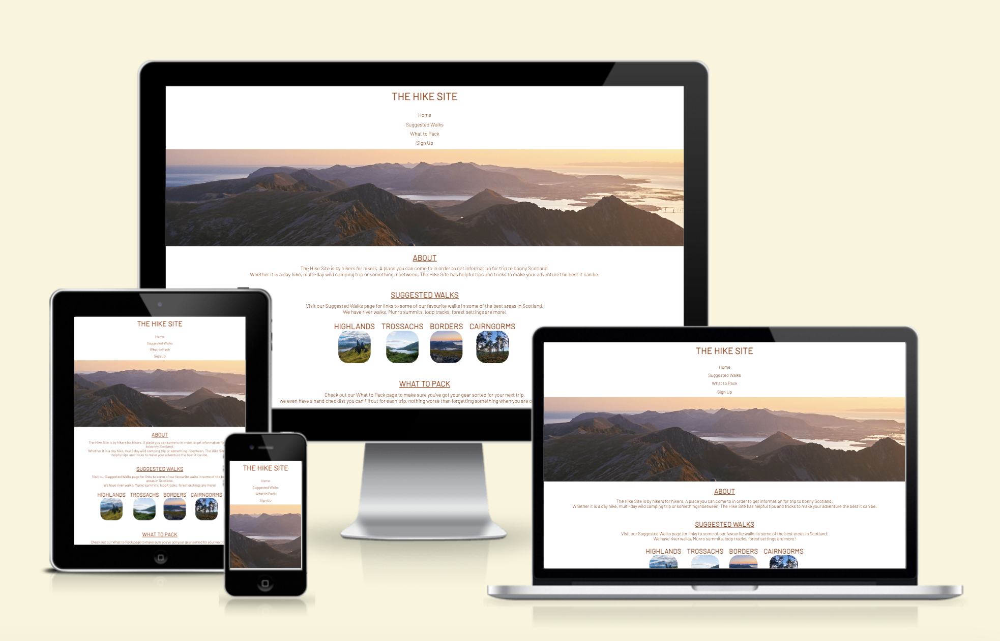
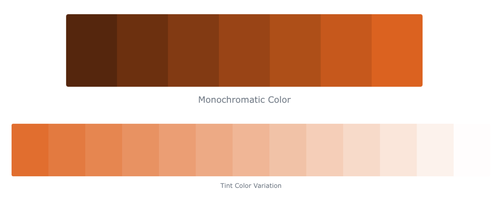
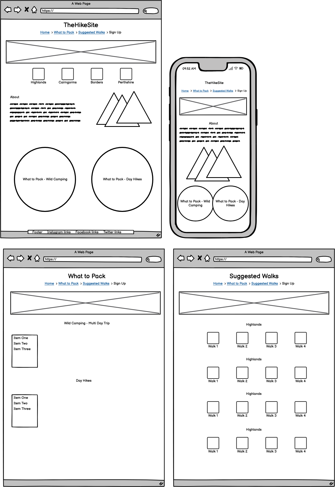
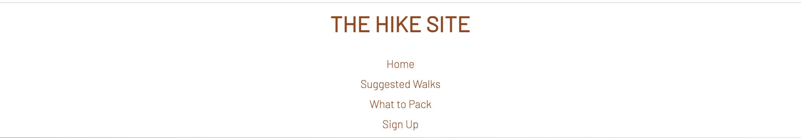
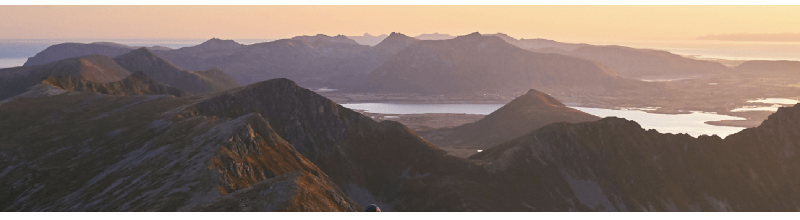
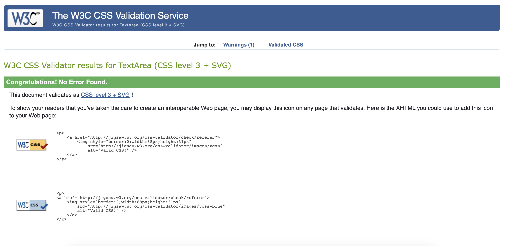

# [The Hike Site](https://sarahgoodwin93.github.io/The-Hike-Site/ "Link to The Hike Site Webpage")

The Hike Site is by hikers for hikers. A place people can come to in order to get information for their hiking trip to Scotland. Could be a day hike or a multi-day wild camping trip, The Hike Site has helpful tips and tricks to make your adventure the best it can be.

The site will target people who are wanting to come to Scotland for a hiking trip and give information about different suggested walks, gear they could take, a checklist and a chance to sign up to a group walk.

The idea of the site comes from a need to combine walking suggestion sites, gear sites and house a checklist, all in the one place, to allow users to come to a one-stop-shop for their trip.

### Target Audience

The target audience for this website is

- Scottish Hikers
- UK Hikers
- Return users
- Community seekers

### User Stories

#### Scottish Hikers

1. As a Scottish hiker, I want to have updates on new gear suggestions every month
2. As a Scottish hiker, I want to be able to navigate to my relevant areas quickly and easily
3. As a Scottish hikers, I want to have suggested walks updated often so I can try new places

#### UK Hikers

1. As a UK hiker, I want to be able to navigate the site with ease, even if I am new to scotland hikes
2. As a UK hiker, I want to be able to see suggested walks so I can plan my trip to Scotland
3. As a UK hiker, I want to be given some information about Scotlands different areas

#### Return Users

1. As a return user, I want to be able to navigate to the checklist quickly and easily
2. As a return users, I expect to see new updates for walks and gear to keep me wanitng to come back
3. As a return user, I want the information I need to be easily accessabile

#### Community seekers

1. As a community seeker, I want to be able to register my intestest in group walks
2. As a community seeker, I want to be able to navigate through the site efficently
3. As a community seeker, I want to have access to new informaiton regarding walks so I can meet with others to walk together

## Design

### Colour Scheme

Using [ColorHexa](https://www.colorhexa.com/984416 "Link to ColorHexa webpage") the colour scheme is based on the colour {#984416}
This is complimented by a lighter tints of {#eeb18f} and {#c4581d}
These colours were chosen as they represent the sunrises and sunsets often seen in Scotland during a hike, this can be seen in the hero image as well where the sunset compliments the colours.

### Wire frames

Wireframes were made at the beginning to flesh out the ideas and user experience of the site. The wireframes were created using a desktop version of [Balsamiq](https://balsamiq.com/ "Link to Balsamiq webpage").

### Typography

The font [Barlow](https://fonts.google.com/?query=Barlow "Link to Barlow on Google Fonts webpage") has been used throughout the site, utilizing different weights and sizes to distigusted headings and text.

Sans-Serif has been applied as a back-up in case of import failure.

## Features

### Navigation

Each page has a navigation menu allowing the user to link back to the page they require information from.
The navigation options include:

- Home
- What to Pack
- Suggested Walks
- Sign Up

The navigation bar stays in the same place for each page, which allows people to navigate throughout the site without having to use a ‘back’ button, and allows them to access all areas of the site at any time.

### Hero Image

As the first thing users the hero image needs to capture their attention and make them want to stay on the site. It also shows that they have arrived at the correct place as it clearly shows both mountains and lochs which Scotland hikes are famous for.

### Home

- The landing includes a photograph that draws users attention to what the site is about and its purpose.
- The homepage gives links to different areas in Scotland for suggested walks to provide quick access to a specific region.
- This section introduces the user to a brief ‘about section’ so that they know if the site will suit their needs or not
- This page also provides links to the What to Pack page to give users additional access

The homepage contains the 'About section', as well as links to the other pages on 'The Hike Site'.

The Suggests Walks buttons allows users to click directly into the area they want to see, rather than having to navigate through the whole page via scrolling.

The two 'What to Pack' buttons allow users to go directly to their releveant walk length to be able to access the checklist straight away.

The homepage will adjust to fit the size of your screen, with elements and sections moving from taking up the full width, to moving on-top of each other for smaller screen sizes.

![Home Page]SCREENSHOT

### What to Pack Page

- The ‘What to Pack’ page allows users to create a checklist of their gear for both wild camping multi-day trips and day trips for around Scotland.
- Users can continue to return to the site to fill out the checklist for each trip they go on, adding value for returning users
- This page will also give links with gear suggestions should users wish to purchase new gear for their trip, there will be a top 5 every month to keep content fresh and exciting for returning users.

![What to pack]SCREENSHOT

### Packing Checklists

Two checklists have been used for the two walk types, wild camping trips and day trips. Users can check that they have everything needed for their trip type in an easy to use checkbox style form, with the ability to reset at the end.

The form does not link to an external place as it is not for capturing data, it is a tool for users.

### Suggested Walks Page

- This 'Suggested Walks' page will provide links to various walks around Scotland with a little insight into each one.
- This section will be updated as new walks are suggested in different areas around Scotland
- Each walk and description has been taken from either [walkinghighlands](https://www.walkhighlands.co.uk/ "Link to walkinghighlands webpage") or [All Trails](https://www.alltrails.com/en-gb/?ref=header "Link to All trails webpage") and each section contains links to these sites and the relevant walk
- 'Back to top' links have been added after each section so that users do not need to scroll all the way back up in they wish to move on from the page.

#### Highlands - There are 4 walks for the Highlands

- BEN NEVIS MOUNTAIN TRACK
- LOST VALLEY, GLEN COE
- THE PAP OF GLENCOE
- LOCH AFFRIC CIRCUIT

#### Trossachs - There are 4 walks for the Trossachs

- CONIC HILL
- BEN LOMOND
- LOCH KATRINE
- LOCH LOMOND, INVERBEG AND GARELOCHHEAD

#### Borders - There are 4 walks for the Borderes

- RIVER TWEED CIRCUIT, MELROSE
- SAINT ABBS HEAD
- GREY MARE'S TAIL AND LOCH SKEEN
- GLENTRESS AND SPOOKY WOOD CIRCULAR

#### Cairngorms - There are 4 walks for the Cairngorms

- BEN MACDUI AND STOB COIRE AN T-SNEACHDA CIRCULAR
- LOCH MORLICH
- NETHY BRIDGE RIVERSIDE AND DELL WOODS
- ROTHIEMURCHUS FOREST CIRCULAR

![Suggested Walks] SCREENSHOT

### The Sign Up Page

- This page will allow the user to get signed up to group walks that will take place in Scotland.
- They will provide their first name, last name, email, which area they prefer and a week range they would like to walk in.

![Sign Up] SCREENSHOT

### Thank You Page

Info about thank you page

### The Footer

The footer section includes links to the relevant social media sites for hiking around Scotland.

The footer is valuable to the user as it encourages them to keep connected via social media

![Footer]SCREENSHOT

### Features Left to Implement

- Users ability to suggest walks – A form where users can comment in a walk they have recently been on with recommendations about the walk (parking, gear, direction etc)

- Users ability to upload photos of their walks in the suggested walks section so that other users can see what it looks like from anothers users perspective

- Weather section so that users travelling to Scotland can see what the weather may be like in certain areas before making the trip up

## Testing

### Manual Testing

- Videos of each page being tested

### Validator Testing

- HTML
  - [W3C validator]
- CSS

  - No errors were found when passing through the official Jigsaw validator

  

### Unfixed Bugs

TO BE ADDED

## Deployment

This project was developed using [Codeanywhere](https://app.codeanywhere.com/ "Link to Codeanywhere login"), which was then committed and pushed to GitHub using the Codeanywehere terminals.

### Deploying on GitHub Pages

To deploy this page to GitHub Pages from its Codeanywhere repository, the following steps were taken:

1. Log into [GitHub](https://github.com/login "Link to GitHub login page") or [create an account](https://github.com/join "Link to GitHub create account page").
2. Locate the [GitHub Repository](https://github.com/sarahgoodwin93/The-Hike-Site "Link to The Hike Site Repo") for The Hike Site.
3. At the top of the repository, select Settings from the menu items.
4. On the side bar menu under 'Code and automation', click on "Pages"
5. Change 'Branch' from "None" to "main", press 'Save'
6. Once saved, wait a few minutes for page to deploy
7. Navigate back to "Pages" and here you will find your deloyed link.

The live link can be found here [The Hike Site](https://sarahgoodwin93.github.io/The-Hike-Site/ "Link to deployed The Hike Site")

## Technologies Used

- [HTML5](https://en.wikipedia.org/wiki/HTML5 "Link to HTML5 wikipedia")
- [CSS3](https://en.wikipedia.org/wiki/CSS "Link to CSS3 wikipedia")

* [Google Fonts](https://fonts.google.com/ "Link to Google Fonts webpage")
  Uused to import the font "Barlow" which was used throughout the platform
* [Codeanywhere](https://app.codeanywhere.com/ "Link to Codeanywhere webpage")
  GitPod was used for writing code, adding, commiting and pushing to girhub
* [GitHub](https://github.com/ "Link to GitHub webpage")
  GitHub was used to store the code files, README files and asset files after pushing
* [Balsamiq](https://balsamiq.com/ "Link to Balsamiq webpage")
  Balsamiq was used to create the wireframes before the project was started to get ideas down and map our the basic structure of the site
* [Canva](https://www.canva.com/en_gb/login/ "Link to Canva webpage")
  Canva Pro was used to create images for the site
* [Am I Responsive?](https://ui.dev/amiresponsive "Link to Am I responsive webpage")
  Am I Responsive was used in order to see responsive design and create screenshots of the final page on different devices.

## Credits

### Content

Wording used for the 'Suggested Walks' page was taken from

- [Walking Higlands](https://www.walkhighlands.co.uk/ "link to walkinghighlands webpage")
- [All Trails](https://www.alltrails.com/en-gb/ "Link to All trails webpage")
  Links to these pages for each section where wording was taken has been added to the page.

### Images

All images were created by Sarah Goodwin, using Canva Pro, stock images were used from canva to create these files

### Education

The following sites assisted in learning more about the code that was being used, or to gain a better understand of how to do things more efficiently

- [Stack Overflow](https://stackoverflow.com/ "Link to Stack Overflow webpage")

* [W3Schools](https://www.w3schools.com/ "Link to W3Schools webpage")

* [Love Running](https://sarahgoodwin93.github.io/Love-Running/ "link to Love Running page")

* HTML & CSS Code Insititue Modules for HTML & CSS and notes taken

* Mentor, Lauren-Nicole, for all her help as support, the useful resources she provided and for being a friendly face throughout!
